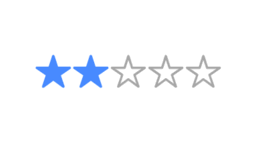

# Ionic Star Ratings Component

## NPM
<a href="https://www.npmjs.com/package/ion-star-ratings">
  
</a>

## About 
- This npm package for ionic angular provides star ratings.
- It allows you to give star ratings between 1 and 5 by default, but you can customize it to offer more options.
- The package supports half-star ratings, allowing you to give ratings like 3.5 stars.
- It offers various parameters such as activeIcon, defaultIcon, halfIcon, halfStar, maxRating, activeColor, defaultColor, readonly, rating, fontSize, ratingChanged, and formControlName. These parameters allow you to customize the appearance and behavior of the star rating component.

## Prerequisite
- Angular: 16.X
- Standalone: true
- Ionic: 7.X


## Demo look



# How to use

## Step 1

### Install it

`npm i ion-star-ratings`

## Step 2

### Import component in any standalone component

`import { IonStarRatingsComponent } from 'ion-star-ratings';`

```
@Component({
    standalone: true,
    imports: [IonStarRatingsComponent]
})
```

### You can use it as follows

```
    <ion-star-ratings
        activeIcon = "star"
        defaultIcon = "star-outline"
        activeColor = "#488aff"
        defaultColor = "#f4f4f4"
        [readonly]="false"
        [halfStar]="false"
        rating="3"
        fontSize = "32px"
        (ratingChanged)="onRatingChange($event)">
    </ion-star-ratings>
```

### You can also use it inside the `<form>` component.

```
    <form [formGroup]="customForm">
        <ion-star-ratings
            activeIcon = "star"
            defaultIcon = "star-outline"
            activeColor = "#d1301a"
            defaultColor = "#aaaaaa"
            [readonly]="false"
            [halfStar]="false"
            fontSize = "32px"
            (ratingChanged)="onRatingChange($event)"
            formControlName="starRating">
        </ion-star-ratings>
    </form>
```

## Options (all are optional, default values are set in the component itself)

- **activeIcon (string)** : can specify the icon name for active rating (icon name should be from the https://ionicframework.com/docs/ionicons/, default is set to 'star');
- **defaultIcon (string)** : can specify the default icon name (icon name should be from the https://ionicframework.com/docs/ionicons/, default is set to 'star-outline');
- **halfIcon (string)** : can specify the icon name for active half rating (icon name should be from the https://ionicframework.com/docs/ionicons/ , default is set to 'star-half');
- **halfStar (boolean)** : to support half star rating set this to `true`, default is set to `false`. The rating value then steps by 0.5 instead of 1. Single tap on defaultIcon changes it to halfIcon , tap on halfIcon changes it to activeIcon and tap on activeIcon changes it to halfIcon again.
- **maxRating (number)** : can specify the total number of icons to be displayed, default is set to 5. You may change this to 10 star rating component or 7 star rating component depending on your requirement.
- **activeColor (string)** : can specify the active color for the active rating icon (should be a valid color code, default is set to '#488aff')
- **defaultColor (string)** : can specify the default color for the rating icon (should be a valid color code, default is set to '#f4f4f4')
- **readonly (boolean)** : default is set to `false`, change to `true` and make it read only. End user won't be able to change the rating then.
- **rating (string or number)** : default is set to 0. input can be of type **number** or **string**.
- **fontSize (string)** : can specify the font-size for the icon ( should be a valid string as used in css, a number followed by letters 'px', default is set to '28px').
- **ratingChanged (function)** : used to handle the rating change in the parent component and do your stuff
- **formControlName** : only if you are using the ion-star-ratings component inside the `<form>` component


## Further help

To get more help on the Angular CLI use `ng help` or go check out the [Angular CLI README](https://github.com/angular/angular-cli/blob/master/README.md).

## Credits
- [All Contributors](https://github.com/squareetlabs/ionic-rating-component)

## License
The MIT License (MIT). Please see [License File](https://github.com/vc-rakesh/ion-star-ratings/blob/main/LICENSE) for more information.
